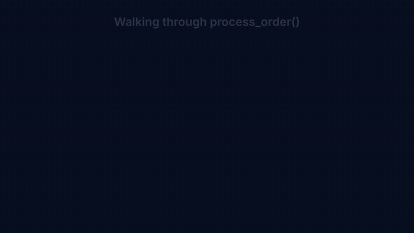
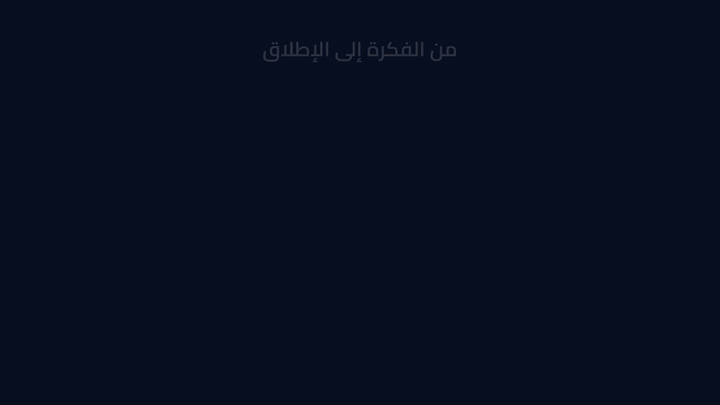
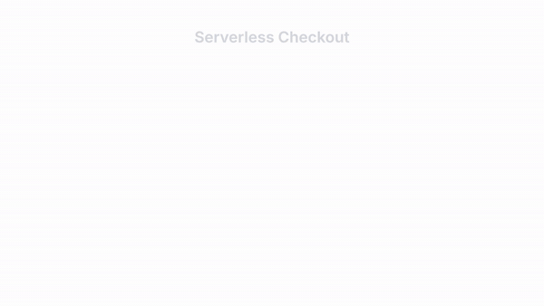
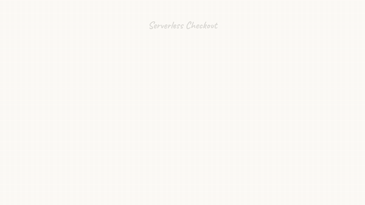
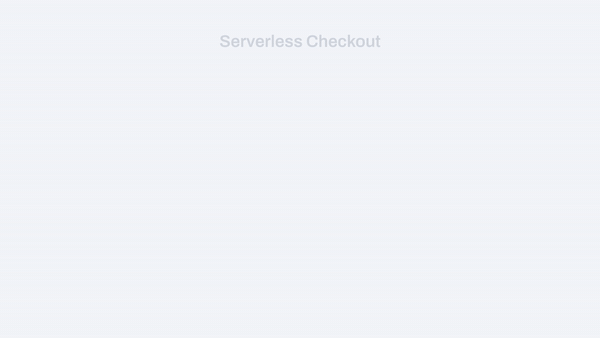
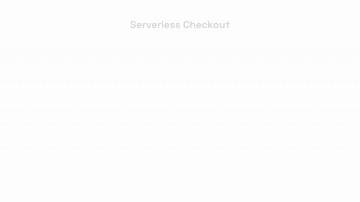

# animated-svg — animated technical diagrams for Claude Code

<p align="center">
  <a href="LICENSE"></a>
  <a href="https://github.com/omkamal/animated-diagrams-skill/stargazers"></a>
  <a href="https://github.com/omkamal/animated-diagrams-skill/network/members"></a>
  <a href="https://github.com/omkamal/animated-diagrams-skill/commits/main"></a>
  
  <a href="https://docs.claude.com/en/docs/claude-code/skills"></a>
  <a href="https://gsap.com"></a>
</p>

Turn a plain-language description — or an existing PNG/SVG/Mermaid/PlantUML
diagram — into a **choreographed, cinema-quality animation**: semantic SVG +
GSAP 3 timeline, rendered deterministically to **MP4 + GIF + SVG + a
self-contained interactive HTML player**.

<p align="center">
  
</p>

<p align="center"><sub>One prompt: <i>“animate my serverless checkout architecture”</i> → this GIF, plus the same animation as
<a href="examples/architecture-demo/renders/demo.mp4">MP4</a> ·
<a href="examples/architecture-demo/renders/demo.svg">static SVG</a> ·
<a href="examples/architecture-demo/renders/demo.interactive.html">interactive HTML with scrubber</a>.</sub></p>

This repository packages the **`animated-svg`** [Claude Code](https://claude.com/claude-code)
skill so anyone can install and use it. Once installed, you just *ask* —
*“animate this architecture diagram”*, *“make a video explaining this flow”*,
*“animated sequence diagram”* — and Claude authors the SVG scene, choreographs
it, renders it, visually verifies the result, and hands you the files.

---

## What it does

| Capability | Details |
|---|---|
| 🏗️ **Diagram types** | Cloud architecture (AWS/GCP/Azure), sequence diagrams, flowcharts, network/data-flow schematics, concept illustrations, Python code walkthroughs |
| 🎨 **12 style presets** | `light` (default) · `dark` · `blueprint` · `sketch` · `corporate` · `pastel` · `mono` · `editorial` · `vivid` · `glass` · `brutalist` · `wireframe` — each a full palette + fonts + shapes + **motion language** ([live gallery](assets/gallery/styles-gallery.html)) |
| 🎬 **Choreography** | Five-act narrative (Establish → Build → Connect → Flow → Resolve): staggered entrances, DrawSVG edge draw-on, MotionPath data pulses, emphasis highlights |
| 🎥 **Camera rig** | 6 pan/zoom patterns for flows bigger than the canvas: guided tour, follow-cam, vertical scroll, conveyor, pulse-zoom, reveal-pan |
| 🖼️ **200k+ cliparts** | Search & fetch open-licensed icons/emojis from Iconify (Noto, Twemoji, OpenMoji, Lucide, Tabler, Carbon, Font Awesome…) at authoring time |
| 🗣️ **Voice-over sync** | Give it an SRT/VTT narration script: every animation beat fires exactly on its cue, and the audio is muxed into the MP4 |
| 🌍 **Arabic / RTL** | Bundled Cairo, Amiri, Tajawal, Reem Kufi fonts; mirrored right-to-left flow geometry via `--lang ar` |
| 📦 **Deliverables** | MP4 (h264) · GIF · static SVG (fonts embedded) · single-file interactive HTML with play/scrub · optional WebM/MOV with alpha, PNG sequences, 4K |
| 🔁 **Deterministic** | Same input ⇒ identical output. Rendering is frame-seeked headless Chrome → FFmpeg (via [HyperFrames](https://www.npmjs.com/package/hyperframes)); network is touched only at authoring time |

## Diagram types

The skill recognizes what kind of diagram you're describing and authors the
right scene + choreography for it. All of the animations below were produced by
this pipeline (sources in [`examples/`](examples/)).

### 🏗️ Cloud architecture

Provider regions/VPCs, compute · data · network nodes, request-flow ordering,
edges that draw on, and a data pulse that rides the path — styled with
AWS/GCP/Azure or generic service icons. *(The hero animation at the top of this
README is an architecture diagram.)* → [`references/diagram-svg-authoring.md`](references/diagram-svg-authoring.md)

### 🔀 Sequence diagrams

Participant lifelines, activation bars that grow as calls land, and messages
that animate **in their travel direction** — requests draw left→right, replies
come back right→left (dashed) — one message in focus at a time.

<p align="center"></p>

→ [`references/sequence-interactions.md`](references/sequence-interactions.md) · also accepts Mermaid / PlantUML source

### 🐍 Python code walkthroughs

A stylized editor panel with real syntax highlighting, a highlight bar that
glides between line ranges, focus-dimming of inactive lines, and a camera that
moves through the file — perfect for narrated explainers (each focus beat can
fire on an SRT cue).

<p align="center"></p>

→ [`references/code-walkthrough.md`](references/code-walkthrough.md) (`scripts/code_to_svg.py` does the tokenizing/highlighting)

### 💡 Concept illustrations

Illustrate *ideas*, not just systems — hero metaphors, idea strips, concept
maps, before/after splits — built from 200k+ open-licensed cliparts & emojis
fetched from Iconify (color emojis keep their colors; line icons take the theme
color).

<p align="center"></p>

→ [`references/concept-illustrations.md`](references/concept-illustrations.md)

### 🔁 Flowcharts &nbsp;·&nbsp; 🌐 network / data-flow schematics

Decision diamonds, process steps and swimlanes (happy path first, then
branches); or generic nodes with labelled edges and data pulses for pipelines
and data-flow schematics. Both follow the same semantic-SVG contract and the
five-act narrative. → [`references/diagram-svg-authoring.md`](references/diagram-svg-authoring.md)

> **Also**: large flows get a [6-pattern camera rig](references/camera-large-flows.md)
> (pan/zoom for scenes bigger than the canvas) and a
> [voice-over sync](references/voiceover-sync.md) mode that fires every beat on
> its SRT cue and muxes the narration into the MP4.

## Arabic & RTL — العربية

Full Arabic / right-to-left support: scaffold with `--lang ar` and the skill
loads the bundled Arabic fonts (Cairo, Amiri, Tajawal, Reem Kufi), applies
proper Arabic shaping/typography, and **mirrors the flow geometry** — the entry
node sits on the **right**, edges draw and arrowheads point **left**, region
titles align top-right, and the camera pans leftward. Any diagram type works in
Arabic.

| | |
|:---:|:---:|
|  |  |
| **رحلة الطلب** — an RTL data-flow architecture: المستخدم → البوابة → الخدمة → قاعدة البيانات, flowing right→left | **من الفكرة إلى الإطلاق** — an RTL concept strip (فكرة → بناء → إطلاق) built with emoji cliparts |

→ [`references/arabic-rtl.md`](references/arabic-rtl.md) · sources in
[`examples/arabic-architecture/`](examples/arabic-architecture/) and
[`examples/arabic-concept/`](examples/arabic-concept/).

## Style gallery

The same scene, re-rendered in 6 of the 12 presets — each preset changes the
palette, the fonts, *and the motion language* (corporate never bounces, sketch
overshoots like a hand-drawn pen, mono reveals in terminal steps…).

| | |
|:---:|:---:|
| <br>**light** — the default. White canvas, slate ink, calm blue | <br>**dark** — deep navy, neon strokes, glow pulses |
| <br>**blueprint** — drafting-table linework, everything draws on | <br>**sketch** — hand-drawn paper & charcoal, Caveat lettering |
| <br>**corporate** — cool gray + indigo, crisp slide-ins, zero bounce | <br>**vivid** — saturated flat color, snappy expo moves |

Six more presets (`pastel`, `mono`, `editorial`, `glass`, `brutalist`,
`wireframe`) live in the **[animated live gallery](assets/gallery/styles-gallery.html)**
(open it in a browser) and are specified in
[`references/style-presets.md`](references/style-presets.md).

## Requirements

| Dependency | Version | Notes |
|---|---|---|
| **Node.js** | ≥ 22 | runs the render pipeline |
| **ffmpeg** | any recent | GIF/WebM derivation, audio muxing |
| **Python 3** | ≥ 3.8 | helper scripts (SVG prep, SRT parsing, code highlighting) |
| **Chrome** | — | downloaded automatically by HyperFrames on first setup (one-time) |
| OS | Linux / macOS / WSL | scripts are bash |

## Install

### As a Claude Code skill (recommended)

Four steps — clone, set up once, symlink into `~/.claude/skills/`, (optionally)
add the agent:

```bash
# 1. Clone wherever you keep tools
git clone https://github.com/omkamal/animated-diagrams-skill.git
cd animated-diagrams-skill

# 2. One-time setup: installs npm deps (gsap + hyperframes), vendors the GSAP
#    plugins, downloads Chrome if needed, and runs a smoke render to prove
#    everything works end-to-end
bash scripts/setup.sh

# 3. Expose it to Claude Code as the `animated-svg` skill
mkdir -p ~/.claude/skills
ln -s "$(pwd)" ~/.claude/skills/animated-svg          # (or cp -r instead of ln -s)

# 4. (optional, for batch jobs) install the companion agent
mkdir -p ~/.claude/agents
cp agents/diagram-animator.md ~/.claude/agents/
```

Those same four steps, animated (this terminal is itself an animated-svg render):


<sub>Made with this skill — see how it was authored in
[`examples/install-walkthrough/`](examples/install-walkthrough/)
([interactive player](examples/install-walkthrough/renders/install.interactive.html) ·
[MP4](examples/install-walkthrough/renders/install.mp4) ·
[source](examples/install-walkthrough/index.html)).</sub>

That's it. Open Claude Code anywhere and ask:

> *“Animate this architecture diagram: users hit CloudFront, then an ALB,
> then a Lambda checkout API that writes to DynamoDB. Dark style.”*

Claude will scaffold a project **in your current directory**, author the SVG
scene and GSAP timeline, render it, check the frames, and deliver
`MP4 + GIF + SVG + interactive HTML` under `./animated-svg-<slug>/renders/`.

Things you can say:

- *“Animate this diagram”* (attach a PNG or SVG — it gets rebuilt cleanly and animated)
- *“Animated sequence diagram of our login flow”* / *“animate this Mermaid/PlantUML file”*
- *“Illustrate the concept of CI/CD with cliparts and emojis”*
- *“Code walkthrough video of `pipeline.py`, highlight the parts as my narration plays”* (attach an SRT)
- *“Make it portrait for a YouTube short”* / *“transparent background”* / *“sketch style”*
- *“رسم متحرك لهذه البنية”* — Arabic in, mirrored RTL animation out

### As a standalone CLI (no Claude required)

The pipeline is plain scripts — you can author scenes by hand:

```bash
git clone https://github.com/omkamal/animated-diagrams-skill.git
cd animated-diagrams-skill && bash scripts/setup.sh

# 1. scaffold a project in your working directory
bash scripts/new_project.sh mydiagram --theme dark --width 1920 --height 1080 --duration 14

# 2. edit ONE file: animated-svg-mydiagram/index.html
#    – put your SVG scene into the layer groups (see references/diagram-svg-authoring.md)
#    – write the GSAP timeline in the marked inline <script> (see references/animation-choreography.md)
#    A complete worked example: examples/architecture-demo/index.html

# 3. (optional) pull cliparts/emojis from Iconify into the project
node scripts/fetch_clipart.mjs --search "rocket"                       # discover
node scripts/fetch_clipart.mjs --project ./animated-svg-mydiagram \
     noto:rocket lucide:database                                       # fetch + inject

# 4. render: MP4 + GIF + static SVG + verification contact sheet
node scripts/render.mjs --project ./animated-svg-mydiagram \
     --gif --svg --snapshots 5 --probe

# 5. bundle the self-contained interactive player (play/pause/scrub)
node scripts/inline_html.mjs --project ./animated-svg-mydiagram
```

Outputs land in `./animated-svg-mydiagram/renders/`.

## Sample outputs (committed in this repo)

Everything below was produced by this pipeline, unedited — see
[`examples/`](examples/) for the authoring sources:

- 🎞️ [`examples/architecture-demo/`](examples/architecture-demo/) — the hero
  animation above as **[MP4](examples/architecture-demo/renders/demo.mp4)**,
  **[static SVG](examples/architecture-demo/renders/demo.svg)**, and a
  **[single-file interactive player](examples/architecture-demo/renders/demo.interactive.html)**
  (download, open in any browser, scrub the timeline) — plus the
  [`index.html` source](examples/architecture-demo/index.html) showing exactly
  how a scene + timeline is authored.
- 🐍 [`examples/code-walkthrough/`](examples/code-walkthrough/) — the Python
  walkthrough above, as [MP4](examples/code-walkthrough/renders/code.mp4) +
  [interactive player](examples/code-walkthrough/renders/code.interactive.html),
  with the [authoring source](examples/code-walkthrough/index.html).
- 🔀 [`examples/sequence-diagram/`](examples/sequence-diagram/) — the login-flow
  sequence diagram, as [MP4](examples/sequence-diagram/renders/seq.mp4) +
  [interactive player](examples/sequence-diagram/renders/seq.interactive.html) +
  [source](examples/sequence-diagram/index.html).
- 🗣️ [`examples/concept-demo/`](examples/concept-demo/) — concept illustration
  built from Iconify cliparts, with a **[narrated MP4](examples/concept-demo/renders/concept-narrated.mp4)**
  whose animation beats fire on the SRT cues (turn your sound on).
- 🇸🇦 [`examples/arabic-architecture/`](examples/arabic-architecture/) &
  [`examples/arabic-concept/`](examples/arabic-concept/) — the two RTL Arabic
  scenes above (MP4 + interactive player + source).
- 📐 [`docs/media/static-export-light.svg`](docs/media/static-export-light.svg)
  — the static resolved-state SVG deliverable (scalable, fonts embedded; what
  you'd drop into a wiki).

## Feature deep-dives

Each feature has a full reference guide in [`references/`](references/):

| Want to… | Read |
|---|---|
| Author the SVG scene (id/class contract, per-diagram-type patterns) | [`diagram-svg-authoring.md`](references/diagram-svg-authoring.md) |
| Choreograph well (narrative arc, timing/easing tables, quality checklist) | [`animation-choreography.md`](references/animation-choreography.md) |
| Pick / understand the 12 styles & their motion languages | [`style-presets.md`](references/style-presets.md) |
| Pan & zoom across large flows (camera rig API, 6 patterns) | [`camera-large-flows.md`](references/camera-large-flows.md) |
| Illustrate concepts with cliparts/emojis (Iconify workflow + license table) | [`concept-illustrations.md`](references/concept-illustrations.md) |
| Sync animation beats to narration (SRT/VTT, audio muxing, verification) | [`voiceover-sync.md`](references/voiceover-sync.md) |
| Animate Python code walkthroughs (syntax highlight, focus bar, scrolling) | [`code-walkthrough.md`](references/code-walkthrough.md) |
| Animate sequence diagrams (Mermaid/PlantUML normalization, message direction) | [`sequence-interactions.md`](references/sequence-interactions.md) |
| Arabic / RTL (fonts, typography rules, mirrored geometry) | [`arabic-rtl.md`](references/arabic-rtl.md) |
| GSAP SVG techniques (DrawSVG, MotionPath, camera math) | [`gsap-svg-techniques.md`](references/gsap-svg-techniques.md) |
| Understand the deterministic renderer (HyperFrames contract, troubleshooting) | [`hyperframes-rendering.md`](references/hyperframes-rendering.md) |
| Export other formats (WebM/MOV alpha, 4K, PNG sequences, ffmpeg recipes) | [`output-formats.md`](references/output-formats.md) |

## Repository layout

```
animated-diagrams-skill/
├── SKILL.md                  # the skill specification Claude Code reads
├── agents/
│   └── diagram-animator.md   # companion agent for batch jobs / delegation
├── assets/
│   ├── themes/               # the 12 style presets (light.css is default) + lang-ar.css
│   ├── fonts/                # 14 bundled woff2 fonts (Latin + Arabic + mono)
│   ├── icons/                # offline icon packs (Font Awesome 6 subset, stylized AWS/GCP/Azure)
│   ├── template/             # composition scaffold (camera rig + layers + HUD)
│   ├── gallery/              # styles-gallery.html — live animated gallery of all 12 styles
│   └── vendor/gsap/          # GSAP dist files (vendored by setup.sh)
├── scripts/
│   ├── setup.sh              # one-time install + smoke render
│   ├── new_project.sh        # scaffold a project (theme/size/duration/RTL/transparent)
│   ├── render.mjs            # MP4 + GIF/WebM/SVG/snapshots + ffprobe sanity
│   ├── export_svg.mjs        # static resolved-state SVG (fonts embedded)
│   ├── inline_html.mjs       # single-file interactive player with scrubber
│   ├── fetch_clipart.mjs     # search + fetch Iconify icons into a project
│   ├── svg_prep.py           # normalize Graphviz/Mermaid SVG → animatable ids
│   ├── code_to_svg.py        # Python source → syntax-highlighted SVG fragment
│   └── srt_to_cues.py        # SRT/VTT → cue table + JS constant
├── references/               # 12 deep-dive guides (see table above)
├── examples/                 # committed sample outputs + authoring sources
└── docs/media/               # the GIFs/SVGs embedded in this README
```

## How it works

1. **Author** — Claude (or you) writes one `index.html`: a semantic SVG scene
   (`node-*`, `edge-*`, `region-*` ids; camera rig; HUD) plus a *paused* GSAP
   timeline registered on `window.__timelines["main"]`.
2. **Render** — [HyperFrames](https://www.npmjs.com/package/hyperframes) seeks
   that timeline frame-by-frame in headless Chrome and pipes the frames to
   FFmpeg. No wall-clock, no `Math.random()` → the render is deterministic.
3. **Verify** — `render.mjs --snapshots` writes a contact sheet of key frames;
   the skill's workflow requires reading it and iterating until the
   [quality checklist](references/animation-choreography.md) passes.
4. **Deliver** — GIF and WebM are derived from the MP4; the static SVG and the
   interactive HTML are exported from the same source of truth.

## License & attribution

This project's own code, themes, templates and docs are **[Apache-2.0](LICENSE)**.
It bundles third-party components that keep their own licenses — bundling them
does **not** change this project's license (it's a normal mixed-license
aggregate). Summary in [`NOTICE`](NOTICE); full texts and the file-by-file
mapping in [`licenses/THIRD_PARTY.md`](licenses/THIRD_PARTY.md).

| Component | Where | License |
|---|---|---|
| Skill code, themes, templates, docs | this repo | Apache-2.0 |
| 12 bundled fonts | `assets/fonts/` | SIL OFL 1.1 ([`licenses/OFL.txt`](licenses/OFL.txt)) |
| Font Awesome 6 Free icon subset | `assets/icons/fa6-common.svg` | CC-BY 4.0 (attribution: Font Awesome) |
| GSAP + DrawSVG/MotionPath/MorphSVG | `assets/vendor/gsap/` (via `setup.sh`) | [GSAP standard "no charge"](https://gsap.com/community/standard-license/) |
| Cliparts fetched by `fetch_clipart.mjs` | **not bundled** — fetched into your project | per icon set (Apache-2.0 · MIT · CC-BY · CC-BY-SA · ISC); table in [`references/concept-illustrations.md`](references/concept-illustrations.md) |

Vendor logos/marks (`logos:`/`devicon:` sets, cloud-provider names) are
trademarks of their owners — nominative use only.

## Star history

If this skill is useful to you, a ⭐ helps others find it.

<p align="center">
  <a href="https://star-history.com/#omkamal/animated-diagrams-skill&Date">
    
  </a>
</p>

---

<p align="center"><sub>Built as a <a href="https://docs.claude.com/en/docs/claude-code/skills">Claude Code skill</a> · animations choreographed with <a href="https://gsap.com">GSAP 3</a> · rendered deterministically with <a href="https://www.npmjs.com/package/hyperframes">HyperFrames</a></sub></p>
